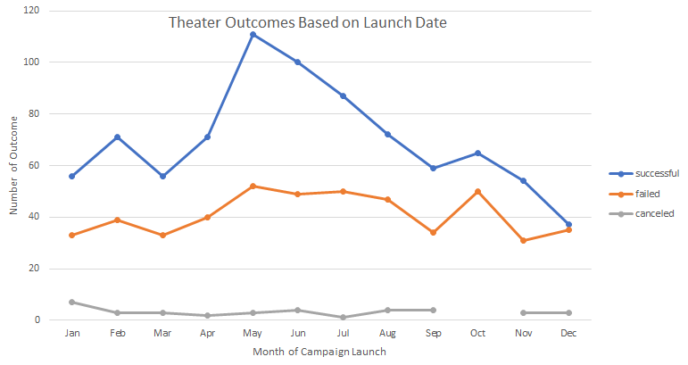

# Kickstarting with Excel

## Overview of Project
This project seeks to show how time of year and target goals impact the success of a Kickstarter campaign. 

### Purpose
The purspose of this analysis is to show success versus failure rates for Kickstarter theater campaigns by month. Looking at the trends may be able to highlight if certain times of year are more likely to result in a successful campaign. Additionally, this analysis will look at Kickstarter campaign success of plays in relation to pledge amount, to determine if certain pledge amounts are more likely to lead to success.

## Analysis and Challenges

### Analysis of Outcomes Based on Launch Date
For the date based analysis, a pivot table and pivot chart were used to examine the data. The number of successful, failed, and canceled campaigns were tallied by each month of the year in the pivot table. The table could be sorted by parent category or year. For this particular set, parent category was selected as Theater. The chart below shows this information graphically.

This chart shows that May has the highest number of successes. June and July are also months with high numbers of successes. This was not due purely to a higher number of campaigns because the number of failures remained similar to other months. The month with the lowest number of successes was December, and it is similar to the number of failures. The number of canceled campaigns was relatively low and consistent by month. Starting a campaign in May, June or July is more likely to yield a successful result.

### Analysis of Outcomes Based on Goals
For the goal based analysis, the countifs command was used to look at the number of successful, failed, and canceled campaigns in certain goal ranges, and focused only on the subcategory plays. This information was plotted in a line graph to show how the percent of successes and failures changed as the goal amount increased. This is shown in the chart below.

This chart shows that low campaign amounts, less than $5000 had the highest percent of successes and campaigns above $45,000 had the lowest percent of successes. In between these values the success and failure numbers varied. 

### Challenges and Difficulties Encountered
One of the challenges in this analysis was ensuring that the countifs formula had all the necessary parameters and then finding an easy way to duplicate it for all the combinations. When using the Countifs function, in order to compare one cell to another the syntax is "=" &CELL is needed, which is different than just "=1000" or "=successful" used for constant parameters. Using the cell command allows copying the cells for failed and canceled without having to manually update the formula for each.

## Results
The Full analysis is located here: KickStarter_Challenge.zip

- What are two conclusions you can draw about the Outcomes based on Launch Date?
1. Launching a campaig in May is more likely to result in success, followed closely by June and July.
2. Launching a campaign is December is the least likely to result in a successful campaign since the number of successes and failures are very similar.

- What can you conclude about the Outcomes based on Goals?
A campaign goal of less than $5000 has a higher likelihood of success than other goals. Goals over $45,000 has the least likelihood of success based on past campaigns. 

- What are some limitations of this dataset?
While the financial metrics are included, it does not give the full picture that might allow us to detect why something failed or succeeded. For example, did a campaign fail because no one knew about it, or because there was something about the campaign itself that dissuaded backers? Including click counts could help track backer interest.

- What are some other possible tables and/or graphs that we could create?
Looking at the success by monthe as percent successful per month could help to show months like May and June were more successful as a percent rather than just due to a larger number of campaigns. We could look at a box and whisker plot to see if the campaigns with high goals were outliers.
